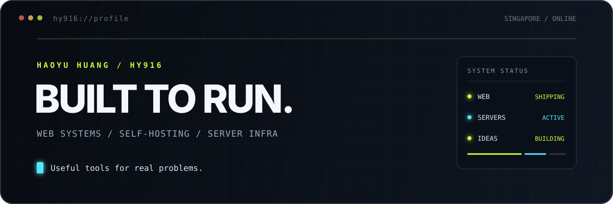

  

  <a href="https://github.com/HY916-cn?tab=repositories">Projects</a>
  ·
  <a href="https://github.com/HY916-cn?tab=stars">Stars</a>
  ·
  <a href="mailto:huanghaoyu.0916@gmail.com">Email</a>

## 关于我

我是 Haoyu，常驻新加坡。我主要开发可自托管的 Web 系统、macOS 原生工具与服务器基础设施。

我偏爱边界清晰、默认可用、真正能够部署和长期维护的软件。比起堆叠功能，更在意一个工具能否把具体问题解决完整。

## 代表项目

<table>
  <tr>
    <td width="50%" valign="top">
      <h3><a href="https://github.com/HY916-cn/flashdrop">Flashdrop</a></h3>
      
使用两位取件码传输文件或文字，支持一次性核销、自动销毁与自托管部署。

      <a href="https://flashdrop.90016.top">在线体验</a> · <a href="https://github.com/HY916-cn/flashdrop">源代码</a>  
      
    </td>
    <td width="50%" valign="top">
      <h3><a href="https://github.com/HY916-cn/CodexMeter">CodexMeter</a></h3>
      
原生 macOS 菜单栏工具，用于查看 Codex 配额、重置时间与历史趋势。

      <a href="https://github.com/HY916-cn/CodexMeter">源代码</a>  
      
    </td>
  </tr>
  <tr>
    <td width="50%" valign="top">
      <h3><a href="https://github.com/HY916-cn/uno">UNO Online</a></h3>
      
基于 WebSocket 的实时多人 UNO，包含多套规则、AI 托管与观战模式。

      <a href="https://uno.90016.top">在线体验</a> · <a href="https://github.com/HY916-cn/uno">源代码</a>  
      
    </td>
    <td width="50%" valign="top">
      <h3><a href="https://github.com/HY916-cn/frp-tunnel-panel">frp Tunnel Panel</a></h3>
      
在 macOS 菜单栏统一管理本地 frpc 与远程 frps，并查看真实连接状态。

      <a href="https://github.com/HY916-cn/frp-tunnel-panel">源代码</a>  
      
    </td>
  </tr>
</table>

<a href="https://github.com/HY916-cn?tab=repositories">查看全部项目 →</a>

## 技术方向

| 领域 | 常用技术 |
| --- | --- |
| Web 应用 | JavaScript、TypeScript、Node.js、React |
| macOS | Swift、SwiftUI |
| 基础设施 | Docker、Nginx、Linux、GitHub Actions |

## 贡献轨迹

<picture>
  <source media="(prefers-color-scheme: dark)" srcset="https://raw.githubusercontent.com/HY916-cn/HY916-cn/output/github-contribution-grid-snake-dark.svg" />
  <source media="(prefers-color-scheme: light)" srcset="https://raw.githubusercontent.com/HY916-cn/HY916-cn/output/github-contribution-grid-snake.svg" />
  
</picture>
